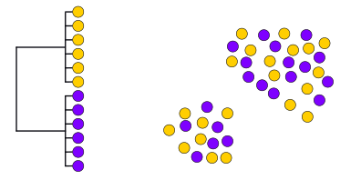
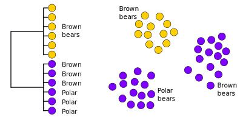
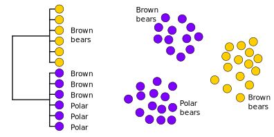
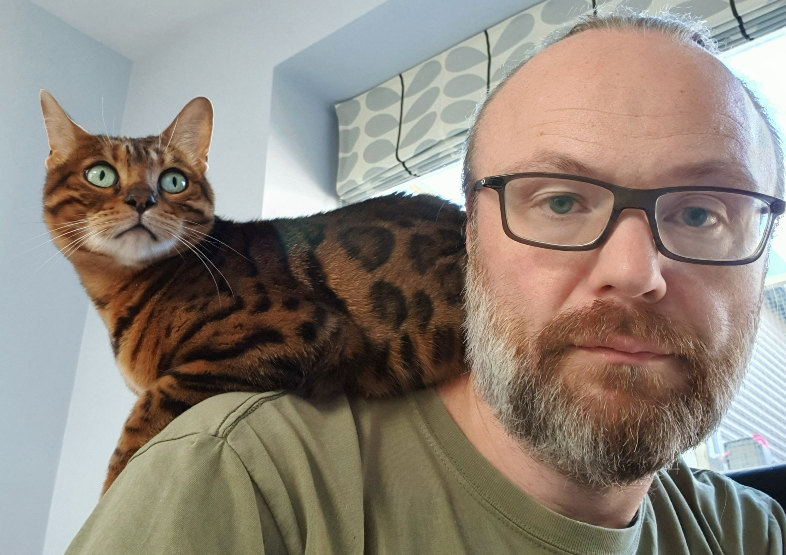

```{r setup, include = FALSE}
library(tidyverse)
library(gganimate)
library(RColorBrewer)
library(knitr)
library(ape)
```

<!-- adding bold and italic options -->
<style>
em {
  font-style: italic
}
strong {
  font-weight: bold;
}
</style>

## Phylogenetics and population genetics lectures

- Key concepts and Single locus phylogenetics
- **Multi-locus phylogenetics**
  - **Theory**
  - **Methods**
  - **Discoveries**
- Population structure
- Conservation genetics

--- .segue .dark 

## Multi-locus phylogenetics - theory

---

## How does the tree form: lineage sorting

```{r, out.width = "100%", dpi = 300, echo = FALSE, fig.align = "center"}
  include_graphics("./assets/img/linsort1.svg")
```

---

## How does the tree form: lineage sorting

```{r, out.width = "100%", dpi = 300, echo = FALSE, fig.align = "center"}
  include_graphics("./assets/img/linsort2.svg")
```

---

## How does the tree form: lineage sorting

```{r, out.width = "100%", dpi = 300, echo = FALSE, fig.align = "center"}
  include_graphics("./assets/img/linsort3.svg")
```

---

## How does the tree form: lineage sorting

```{r, out.width = "100%", dpi = 300, echo = FALSE, fig.align = "center"}
  include_graphics("./assets/img/linsort4.svg")
```

---

## How does the tree form: lineage sorting

```{r, out.width = "100%", dpi = 300, echo = FALSE, fig.align = "center"}
  include_graphics("./assets/img/linsort5.svg")
```

---

## Lineage sorting summary

- Drift sorts the lineages into clades
- This takes time, we can't detect the divergence immediately
- We go through stages of complete/incomplete monophyly
- incomplete to complete lineage sorting
- lineage sorting is faster when the population size is small (= more drift)
- Mutation builds upon the clades, monophyly is retained [unless there is gene flow]
- ILS can be a real problem for inferring relationships, especially in large populaitons with recent divergence events

--- @vcenter bg:white

```{r, out.width = "60%", dpi = 300, echo = FALSE, fig.align = "center"}
  include_graphics("./assets/img/istockphoto-840934838-612x612.jpg")
```

--- 

## Relying on a single locus tree could be misleading

- Incomplete lineage sorting could mean that clades do not correspond to species/populations
- Old divergence with small populations less likely to cause problems
- But no way of easily predicting/testing this from a single tree
- Also may fail to account for sex-specific differences (e.g. mtDNA and Y chromosome)

### Solution: multiple loci

- Increased statistical confidence
- Can detect sex-specific differences
- Can also quantify ILS (says something about pop size and divergence time)
- Potential to study **gene flow** [more later]

--- .segue .dark 

## Multi-locus phylogenetics - methods

---

## Getting the data

### Modest number of loci

- Several PCRs
- Transcriptomes
- Hybridisation capture
  - Ultraconserved elements
  - Exomes

### Whole genomes

- de novo assembly and whole genome alignment [hard]
- shotgun whole genome resequencing

---

## Shotgun whole genome sequencing

```{r, out.width = "95%", dpi = 300, echo = FALSE, fig.align='center'}
include_graphics("./assets/img/aDNA_seq.svg")
```

---

## Mapping to reference genome assembly

- Whole sample DNA is sequenced in short reads
- These are "mapped" to a reference whole genome sequence based on similarity
  - Nuclear chromosomes
  - Mitochondrial/chloroplast genomes
  - Potentially other genomes too (bacteria, pathogens, etc.)
  - Around £200 for a 2-3Gb genome, currently

```{r, out.width = "95%", dpi = 300, echo = FALSE, fig.align='center'}
include_graphics("./assets/img/pseudohap.svg")
```

---

## Data analysis

### Separate loci

- Analyse each locus separately, look for concordant patterns
- Combine all together (concatenation)
- More complex models, e.g. multispecies coalescent

### Whole genome

- Concatenation easy
- Divide chromosomes into non-overlapping chunks (very approximate)
  - not based on actual recombination points
  - mostly the diploid alleles are not phased
  - in practise works very well
- More sophisticated methods that identify the true breakpoints between loci 

--- .segue .dark 

## Multi-locus phylogenetics - discoveries

--- &twocol

## Brown bear and polar bears

*** =left

```{r, out.width = "100%", dpi = 300, echo = FALSE, fig.align = "center"}
  include_graphics("./assets/img/arctos_mt.svg")
```

*** =right

```{r, out.width = "100%", dpi = 300, echo = FALSE, fig.align = "center"}
  include_graphics("./assets/img/arctos_map.svg")
```

- Brown bears not monophyletic
- Divergence time ~120 Ka
- Incomplete lineage sorting (result of recent speciation)?
- Something else?
- Multiple divergent brown bear clades
- Evidence of glacial refugia

--- bg:white

## Brown bear and polar bear Y chromosome

```{r, out.width = "100%", dpi = 300, echo = FALSE, fig.align = "center"}
  include_graphics("./assets/img/arctos_y.svg")
```

--- &twocol bg:white

## Brown bear and polar bear autosomes

*** =left

```{r, out.width = "80%", dpi = 300, echo = FALSE, fig.align = "center"}
  include_graphics("./assets/img/arctos_auto.svg")
```

*** =right

- mtDNA suggests recent speciation and brown bear glacial refugia
- Y chromosome suggests species monophyly, no evidence of brown bear refugia
- Autosomes show species monophyly, and that the species are OLD (latest estimates, 1 million years)

### Explanation

- The 2 species are old and distinct
- Males move about more than females
- More recent mtDNA divergence suggests **gene flow**

--- .segue .dark 

## Detecting gene flow

---

## Speciation with complete lineage sorting

```{r, out.width = "100%", dpi = 300, echo = FALSE, fig.align = "center"}
  include_graphics("./assets/img/beary1.svg")
```

---

## Speciation with complete lineage sorting

```{r, out.width = "100%", dpi = 300, echo = FALSE, fig.align = "center"}
  
```

---

## Speciation with complete lineage sorting

```{r, out.width = "100%", dpi = 300, echo = FALSE, fig.align = "center"}
  include_graphics("./assets/img/beary3.svg")
```

---

## Speciation with complete lineage sorting

```{r, out.width = "100%", dpi = 300, echo = FALSE, fig.align = "center"}
  include_graphics("./assets/img/beary4.svg")
```

---

## Speciation with complete lineage sorting

```{r, out.width = "100%", dpi = 300, echo = FALSE, fig.align = "center"}
  include_graphics("./assets/img/beary5.svg")
```

--- .segue .dark 

## What if lineage sorting is incomplete?

---

## Speciation with incomplete lineage sorting

```{r, out.width = "100%", dpi = 300, echo = FALSE, fig.align = "center"}
  include_graphics("./assets/img/beary1.svg")
```

---

## Speciation with incomplete lineage sorting

```{r, out.width = "100%", dpi = 300, echo = FALSE, fig.align = "center"}
  
```

---

## Speciation with incomplete lineage sorting

```{r, out.width = "100%", dpi = 300, echo = FALSE, fig.align = "center"}
  include_graphics("./assets/img/ils3.svg")
```

---

## Speciation with incomplete lineage sorting

```{r, out.width = "100%", dpi = 300, echo = FALSE, fig.align = "center"}
  
```

--- .segue .dark 

## Or...

---

## Speciation with incomplete lineage sorting

```{r, out.width = "100%", dpi = 300, echo = FALSE, fig.align = "center"}
  include_graphics("./assets/img/ils3.svg")
```

---

## Speciation with incomplete lineage sorting

```{r, out.width = "100%", dpi = 300, echo = FALSE, fig.align = "center"}
  
```

---

## Simulator

<iframe src = 'https://www.whfreeman.com/BrainHoney/Resource/6716/SitebuilderUploads/Hillis2e/Student%20Resources/Animated%20Tutorials/pol2e_at_1502_genetic_drift_simulation/pol2e_at_1502_genetic_drift_simulation.html' height='600px'></iframe>

---

## Summary

- [Note these a just some of the many outcomes you could imagine]
- The danger zone is when alleles fail to reach fixation early in the speciation process
- i.e. prior to brown bear population divergence in the example
- Because there is no selection for specific alleles, the process is random
- Either brown bear population may end up grouping with the polar bears

### What can you predict about the relative frequencies of these alternatives?

---

## Expected tree frequecies under ILS?

```{r, out.width = "100%", dpi = 300, echo = FALSE, fig.align = "center"}
  include_graphics("./assets/img/freq.svg")
```

--- .segue .dark 

## What about gene flow?

---

## Speciation with complete lineage sorting

```{r, out.width = "100%", dpi = 300, echo = FALSE, fig.align = "center"}
  include_graphics("./assets/img/beary5.svg")
```

---

## Speciation with complete lineage sorting

```{r, out.width = "100%", dpi = 300, echo = FALSE, fig.align = "center"}
  include_graphics("./assets/img/bearyG.svg")
```

---

## Speciation with complete lineage sorting

```{r, out.width = "100%", dpi = 300, echo = FALSE, fig.align = "center"}
  include_graphics("./assets/img/bearyG2.svg")
```

---

## Expected tree frequencies with gene flow?

```{r, out.width = "100%", dpi = 300, echo = FALSE, fig.align = "center"}
  include_graphics("./assets/img/flow.svg")
```

---

## Summary

- An inbalance in the non-species tree topologies provides evidence of gene flow
- Only works if you have sequenced a LOT of loci (whole genomes)
- Can detect very ancient events
- And sex-biases (e.g. X chromosome vs. autosome)
- Sometimes based on SNPs (D statistics, F-ratio statistics), essentially the same
- Revealed many examples of gene flow in the past decade

--- &twocol

## Brown bear and polar bears

*** =left

```{r, out.width = "100%", dpi = 300, echo = FALSE, fig.align = "center"}
  include_graphics("./assets/img/arctos_mt.svg")
```

*** =right

**Nuclear genomes, 100 kb windows**

```{r, out.width = "80%", dpi = 300, echo = FALSE, fig.align = "center"}
  include_graphics("./assets/img/abc.svg")
```

---

## Brown bear and polar bear reading

```{r, out.width = "100%", out.height=500, dpi = 300, echo = FALSE}
  include_graphics("./assets/img/2015-Genomic_evidence_of_geographically_widespread_effect_of_gene_flow_from_polar_bears_into_brown_bears..pdf")
```

---

## Brown bear and polar bear reading

```{r, out.width = "100%", out.height=500, dpi = 300, echo = FALSE}
  include_graphics("./assets/img/2014-Brown_and_polar_bear_y_chromosomes_reveal_extensive_male-biased_gene_flow_within_brother_lineages.pdf")
```

--- &twocol

## Cave bears and brown bears

*** =left

- Cave bears are sister lineage to brown bears and polar bears
- Giant vegan bears
- Extinct ~25 Ka
- Lived alongside brown bears for most of their evolutionary history

*** =right

```{r, out.width = "100%", dpi = 300, echo = FALSE, fig.align = "center"}
  include_graphics("./assets/img/kudarensis.png")
```

```{r, out.width = "90%", dpi = 300, echo = FALSE, fig.align = "center"}
  include_graphics("./assets/img/Ursus_spelaeus_Sergiodlarosa.jpg")
```

--- &twocol

## Cave bears and brown bears

*** =left

**Nuclear genomes, 25 kb windows**

```{r, out.width = "80%", dpi = 300, echo = FALSE, fig.align = "center"}
  include_graphics("./assets/img/cave_freq.svg")
```
*** =right

```{r, out.width = "100%", dpi = 300, echo = FALSE, fig.align = "center"}
  include_graphics("./assets/img/kudarensis.png")
```

```{r, out.width = "90%", dpi = 300, echo = FALSE, fig.align = "center"}
  include_graphics("./assets/img/Ursus_spelaeus_Sergiodlarosa.jpg")
```

---

## Cave bear reading

```{r, out.width = "100%", out.height=500, dpi = 300, echo = FALSE}
  include_graphics("./assets/img/Barlow et al. - 2018 - Partial genomic survival of cave bears in living brown bears.pdf")
```

--- &twocol

## Neanderthals and anatomically modern humans

*** =left

- Extinct population of humans
- Extinct ~40 Ka
- Basically a human (many morphological characters overlapping)
- Advanced culture, hunting technology, art, etc.
- Major dispersal of anatomically modern humans 70-50 Ka
- Population replacement or admixture?

*** =right

```{r, out.width = "100%", dpi = 300, echo = FALSE, fig.align = "center"}
  include_graphics("./assets/img/neanderthal_woman-4x3.jpg")
```

--- &twocol

## Neanderthals and anatomically modern humans

*** =left

```{r, out.width = "100%", dpi = 300, echo = FALSE, fig.align = "center"}
  include_graphics("./assets/img/neander.svg")
```

[SNP based analysis, but essentially the same]

*** =right

```{r, out.width = "100%", dpi = 300, echo = FALSE, fig.align = "center"}
  include_graphics("./assets/img/neanderthal_woman-4x3.jpg")
```

---

## Neanderthal reading

```{r, out.width = "100%", out.height=500, dpi = 300, echo = FALSE}
  include_graphics("./assets/img/2010-A_draft_sequence_of_the_Neandertal_genome..pdf")
```

--- &twocol

## Bengal cat

*** =left

```{r, out.width = "90%", dpi = 300, echo = FALSE, fig.align = "center"}
  
```

```{r, out.width = "90%", dpi = 300, echo = FALSE, fig.align = "center"}
  include_graphics("./assets/img/Asian-Leopard-Cat-Prionailurus-bengalensis-758x432.webp")
```

*** =right

- Hybrid domestic cat/*Prionailurus bengalensis*
- F1 hybrids backcrossed 6+ generations
- Selection for coat pattern and other introgressed traits
- A framework to better understand the process and refine methodologies???

```{r, out.width = "80%", dpi = 300, echo = FALSE, fig.align = "center"}
  include_graphics("./assets/img/prio.svg")
```

--- .segue .dark 

## Looking for an MSc project???

--- &thankyou

## Next time

**Population structure**

